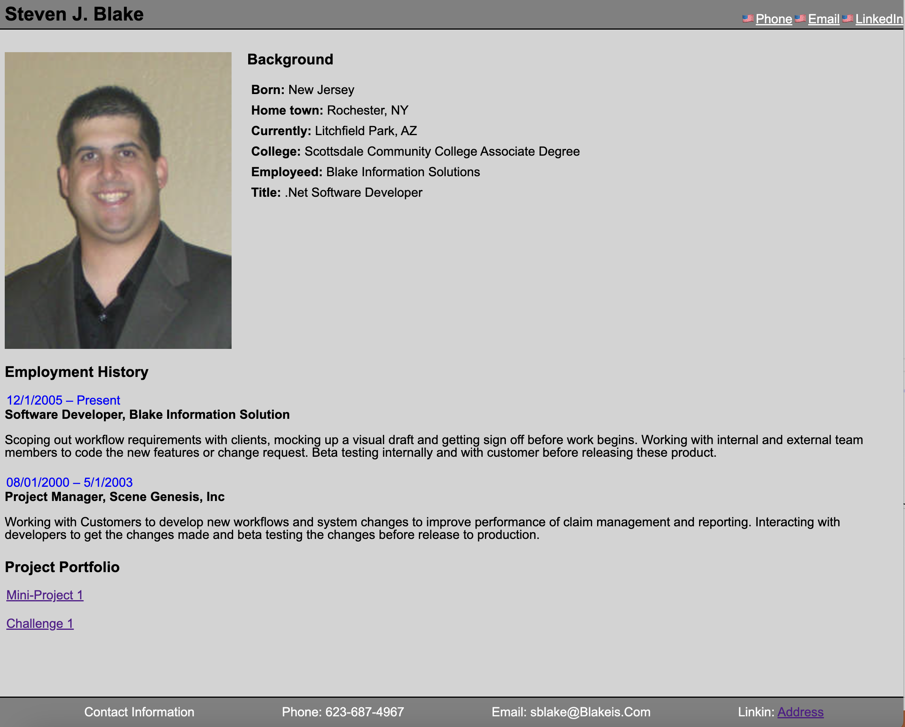

# SB-Challenge-2-ASU
Profile

objective 

Design a page to display your contact information, background and show case your skills

Inorder to create a page we need to setup the following

1. Create a repository to hold this project
2. Create a directory structure and pages for this project
    a. Readme.md
    b. reset style.css
    c. style.css
    d. Profile.html
    e. Images Folder
        1. Place headshoot or images of webpages we worked

3. Design a layout for the page
    a. Wire mock up

4. Figure out a good color scheme to use on the page. You want it easy on the eyes and have key words Pop for a potential employees to focus on.

5. Review your work history and past project to see which ones you like to show case.

6. Build the profile page 

screen shot

7. push it back up to git hub

8. deploy

Link

